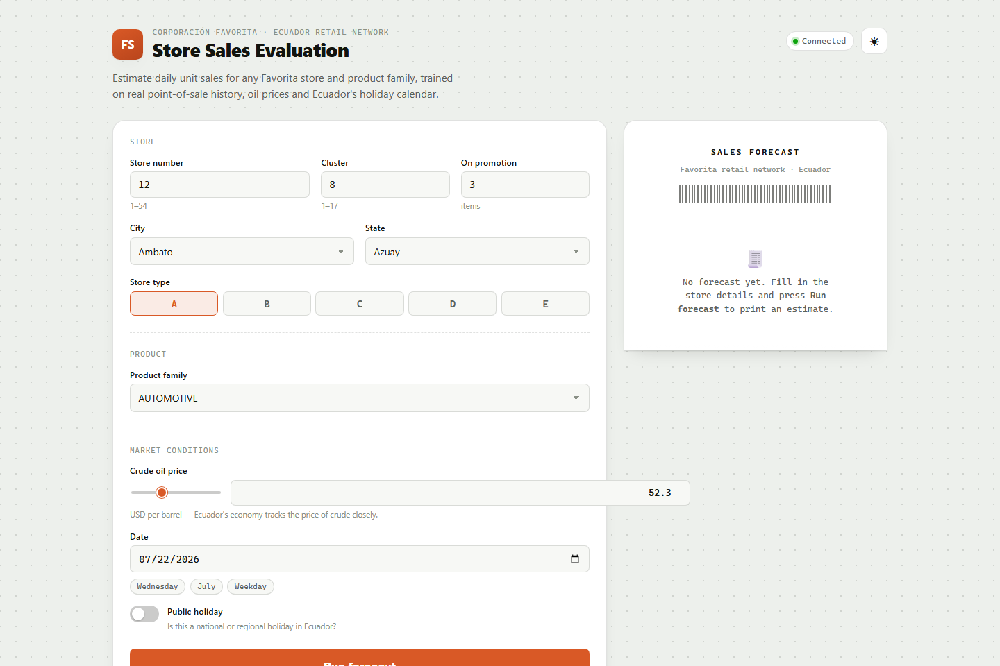

# Store Sales Evaluation


> A point-of-sale-styled web app that forecasts daily unit sales for Corporación Favorita, Ecuador's largest retail chain, using a Random Forest model trained on real Kaggle competition data.

## Why This Exists

Retail planners need a fast way to sanity-check how store, product, and market conditions move daily sales — without opening a notebook. This project trains a regression model on the real ["Store Sales - Time Series Forecasting"](https://www.kaggle.com/competitions/store-sales-time-series-forecasting) Kaggle dataset and serves it behind a small FastAPI app, wrapped in a UI styled like a printed cash-register receipt.

## Screenshot



## Features

- Predicts daily unit sales for any Favorita store number and product family
- Trained on real point-of-sale history merged with store metadata, crude oil prices, and Ecuador's national holiday calendar
- Live feature-importance breakdown alongside every prediction
- Model R² and MAE reported directly in the UI
- Receipt-themed frontend — mono font, dashed rules, barcode strip, torn-edge card — built with vanilla JS and Jinja2, no frontend framework
- Single `/predict` JSON endpoint, easy to call from scripts or other services

## Dataset & Model

This is not synthetic data — it's a real sample from the Kaggle **Store Sales - Time Series Forecasting** competition (Corporación Favorita, an Ecuadorian grocery retailer):

- **`train_sample.csv`** — a 60,000-row sample drawn from the competition's training set (store, date, product family, unit sales, promotion flag)
- **`stores.csv`** — store metadata (city, state, store type, cluster), merged in on `store_nbr`
- **`oil.csv`** — daily WTI crude oil price, merged in on `date` (Ecuador's economy is oil-dependent, so this is a meaningful signal); missing days are forward/backward filled
- **`holidays_events.csv`** — the national holiday calendar, used to derive an `is_holiday` flag (transferred holidays are excluded)

On top of the merged table, the app engineers day-of-week, month, day-of-month, and weekend features, then label-encodes all categoricals (product family — 33 real categories — city, state, store type).

At startup, `main.py` trains two `RandomForestRegressor` models on an 80/20 split — one on raw sales, one on a `log1p`-transformed target — and keeps whichever scores higher on held-out R². The log-transformed model currently wins, since Favorita's sales distribution is heavily right-skewed:

| Metric | Value |
|---|---|
| Target transform | `log1p` (inverse-transformed before returning predictions) |
| R² (test) | **0.83** |
| MAE (test) | **100.33** |

Feature importances are recomputed at startup and returned with every prediction.

## Tech Stack

| Layer | Tools |
|---|---|
| Backend | Python, FastAPI, Uvicorn |
| ML | scikit-learn (`RandomForestRegressor`, `LabelEncoder`) |
| Data | pandas, NumPy |
| Templating | Jinja2 |
| Frontend | Vanilla JavaScript, HTML/CSS (no build step) |
| Container | Docker |

## Run Locally

**Prerequisites**: Python 3.11+

```bash
git clone https://github.com/ErdoganPeker/Store-Sales-Evaluation.git
cd Store-Sales-Evaluation/app

python -m venv .venv
.venv\Scripts\activate        # Windows
# source .venv/bin/activate   # macOS/Linux

pip install -r requirements.txt
python main.py
```

The app trains the model on startup, then serves the UI at **http://localhost:5004**.

### Run with Docker

```bash
docker build -t store-sales-evaluation .
docker run -p 8000:8000 store-sales-evaluation
```

This serves the app at **http://localhost:8000**.

## Project Structure

```
Store-Sales-Evaluation/
├── app/
│   ├── main.py              # FastAPI app: training + /predict endpoint
│   ├── requirements.txt
│   └── templates/
│       └── index.html       # Receipt-themed UI
├── store_sales_data/        # Kaggle competition CSVs (train/stores/oil/holidays)
├── Store Sales Evaluation.ipynb   # Original exploratory analysis notebook
├── Dockerfile
└── screenshot.png
```

## Developer

**Erdoğan Yasin Peker**
[GitHub](https://github.com/ErdoganPeker) · [LinkedIn](https://www.linkedin.com/in/erdogan-yasin-peker-b107ba24b/)
